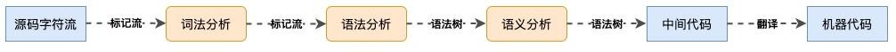
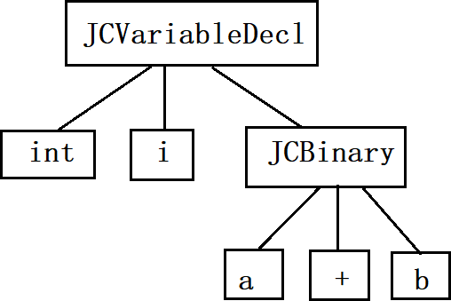

校招 ： 基础(JavaSE、数据库)，数据结构和算法，加分项（开源框架、高并发、JVM 等）
社招 ： 项目

## 1. java跨平台

java 是一个门**跨平台**语言：一次编写(张总的演讲)， 处处运行（可以被
世界各地、不同国家的听众 收听）
java 能够跨平台的原因，是因为有各种类型的 jvm（windws jvm ,mac
jvm,linux jvm ；JDK 包含了 JVM），且各个 jvm 不跨平台
类比： **JVM** **相当于翻译官**
编译：.java (编译器)-> .class 文件 (JVM)-> 0 1 1 0
**聊聊*"*编译*"***
C、C++、Java、python 等都属于是高级语言，而非二进制语言。0 1 0 1
public class Test{} -> 0 1 1 0
想让计算机识别 Java 代码，那就需要编译。
把他翻译成二进制文件，这个过程就叫编译。负责这一个过程的处理的工具叫做编译器。
说明：class 是 16 进制的文件流，最终会被 jvm 转成二进制的机械码。
java -> class ->不同操作系统上的 jvm -> jvm 对应的操作系统

### 1.1 编译过程



- **编译前端**：将`*.java`转换为`*.class` 的过程

  主要就是 javac 编译，包含了以下过程：

  -   **词法分析**：int i = a + b ; (每个字符 进行标记)，将其中的 int、i、=、a、+、b、；等各个部分解析成相应的**标记**。例如，将 int 标记为 TokenKind.INT，将 i 标记为 TokenKind.IDENTIFIER

  - **语法分析**：分析各个标记之间的关系，并将这些关系以树的形势展现，即生成**抽象语法树**。
  
    
  
  - **填充符号表**：
  
    将开发者自定义的信息 转成 JVM 能够理解的符号 ->填充符号表
  
    收集信息（类型、变量、方法的定义），最终生成符号表（符号表包含了标记符、标记符类型、作用域等信息）。若类中没有提供构造方法，还会生成一个无参构造。
  
  - 执行注解处理器：处理特定的注解，注解 -> JVM 可理解的符号
  
  - **语义分析**：语义合法性检查（方法的返回值与声明的类型是否一致）、检查是否有重复定义、检查变量/方法/类的访问修饰符是否满足条件；常量折叠（常量运算、字符串拼接在编译期间完成合并）；选择最佳的重载方法；数据与控制流分析（非void **是否有**返回值，异常是否已处理，局部变量是否初始化，final 变量是否已赋值，代码是否不可达）；解语法糖；
  
  - 写语法糖 -> 执行时解语法糖 -> 无糖代码
  
    -   语法糖：高级语言中的某种语法，这些语法糖在编译时进行解语法糖，转换为无糖语法。这些语法糖大多都是靠编译器实现，而不是依赖字节码或者虚拟机的底层支持。如自动装箱 Integer i =1;、拆箱。一些"基本功能"是编程语言自身提供的，即语法糖。
  
  - 输出字节码（ 生成 class文件）：代码添加（增加\<init\>等标识代码）；代码转换（**优化**，将字符串变量的拼接转为StringBuilder#append）
  
    .java -\.class -> 二进制：两种策略
  
- 编译后端：将编译前端的产物 Class 文件 -> 二进制文件。但是对于来说，它是不认得字节码的，**每种`cpu`只能读懂自身支持的机器语言 （windows c++ , 可以直接运行 c++） 或者 本地代码（native code）。**
  JVM 需要将 class 翻译 成 **机器码**(二进制) 再执行，**翻译**有两种策略：`解释执行` 和`编译执行（即时编译）` 。

  - `解释执行`
    - 解释器

    - 以解释方式运行字节码

    - **读一句，执行一句。**

    - 启动效率快，整体的执行较慢。
  - `编译执行（即时编译）`
  - 编译器
    - 将字节码编译成机器码
    - 直接执行机器码

    - 运行时编译

    - 编译后，性能有数量级的提升。
  - 启动较慢，执行较快。

    -   hotspot 中有两种即时编译器 Client Complier(C1) 和 **Server** Complier(C2)

  - Client 模式下的 C1 编译器：简单优化，耗时短（速度）

## 2. **jvm**、**jre** 和 **jdk** 三者的关系

jvm:java 虚拟机 java virtual machine

jre:java 运行环境，java runtime environment ， jvm + 核心类库:只能运行JAVA 程序，但不能开发 jdk: jre+运行环境工具，java development kit ：既能运行 JAVA 程序，又能开发

**jvm**（识别 **class**）**\<jre**（**jvm+**类库，运行程序）**\<jdk**（**jre+**开发工具集，运行且开发）

开发人员需要下载并安装 jdk
jdk 版本说明： jdk 8u192 及以前版本 （免费）

## 3. 基本类型变量的注意事项

### 3.1 数据运算

```java
byte,short 特殊情况
byte = byte + byte ;× ，因为不是赋值语句
byte += byte ; √
```

char -> int

```java
char ch = 'A' ;
System.out.println(ch);
System.out.println(ch+0);// 65
```

float x = 123.4 ; × ，float = double

### 3.2 **精度丢失**

System.out.println( 3*0.3f );

运算结果 0.90000004 等

float ，int : 32bit（理解） bit ：位 -> 0 1 -\两种可能

int 的范围 能够容纳下 2 的 32 次方 个数字 ， -2,147,483,648 \~
+2,147,483,647 整整占满 了 32bit

float 表示的小数有无穷无尽个数字 ， 因此 2 的 32 次方个位置无法容纳全部小数。小数的计算，只能模拟：通过 计算方法。

2 的 n 次方： 1/2 ， 1/4

0.5 +0.25 = 0.75

0.1 是 2 的几次方？ 多少个 2 的 n 次方之和

根本原因是：计算机只能用 **二进制 （2 的 n 次方）+ 计算方法**

拼接成最终的数字，根本就不能精确的表示很多小数，比如 0.1 等

**如何解决**

**浮点数运算 不要轻易使用 float、double** -> BigDecimal

BigDecimal: 加减乘除
《阿里巴巴 Java开发手册》中提到："为了避免精度丢失，可以使用`BigDecimal`来进行浮点数的运算"。

**浮点数之间的等值判断，基本数据类型不能用 == 来比较，包装数据类型（Float，Double） 不能用 equals 来判断。**

```java
3*0.3f == 0.9f // false
```

`BigDecimal`可以实现对浮点数的运算，**不会造成精度丢失**。通常情况下，大部分需要浮点数精确运算结果的业务场景都是通过`BigDecimal`来做的。

```java
BigDecimal a = new BigDecimal("1.0");
BigDecimal b = new BigDecimal("0.9");
System.out.println(a.add(b));// 1.9
System.out.println(a.subtract(b));// 0.1
System.out.println(a.multiply(b));// 0.90
System.out.println(a.divide(b));// 无法除尽，抛出
// ArithmeticException 异常
System.out.println(a.divide(b, 2, RoundingMode.HALF_UP));//1.11
new BigDecimal("3").multiply( new BigDecimal("0.3")); // 0.9
```

## 4. 成员变量与局部变量的区别？

```java
public class A{
	public static int num1 ; //成员变量，有默认值 (属于类 ， a.num1 = 10 ;)
	public int num3 ; // （属于对象 a = 10 ;）
	public void method(){
		final int num2 = 0; // 局部变量，必须赋初始值
	}
}
```

-   **语法形式**：从语法形式上看，成员变量是属于类的，而局部变量是在代码块或方法中定义的变量或是方法的参数；
-   **修饰符**：成员变量可以被`public`等访问控制修饰符及`static`所修饰，而局部变量不能；成员变量和局部变量都能被`final`所修饰。

-   **生存时间**：从变量在内存中的生存时间上看，成员变量是对象的一部分，它随着对象的创建而存在，而局部变量随着方法的调用而自动生成，随着方法的调用结束而消亡。
-   **默认值** ：从变量是否有默认值来看，成员变量如果没有被赋初始值，则会自动以类型的默认值而赋值（一种情况例外:被`final`修饰的成员变量也必须显式地赋值），而局部变量则不会自动赋值。

-   **存储方式** ：从变量在内存中的存储方式来看,如果成员变量是使用`static`修饰的，那么这个成员变量是属于类的，如果没有使用
    `static`修饰，这个成员变量是属于实例的。而对象存在于堆内存，局部变量则存在于栈内存。
    静态成员变量属于类；非静态成员变量属于对象；方法中的变量属于方法；

引申：基本数据类型在栈内存中，还是堆内存中？

对象存在于 堆内存中，引用存在于栈中。（Person p = new Person() ;）

```text
- p ：引用
- new Person()：对象
```

取决于**基本数据**类型被声明的位置

-   **成员变量**

class A{ int a ;}，a 在堆中

在堆内存中（对象类型和基本类型，都在堆中）。

(示例仅用于证明 基本类型在逻辑上 的确存在于 堆中)例如 new int\[\]{1,2}这个对象时存储在堆中的，因此 1,2
这两个基本数据类型是存储在堆中。

-   **局部变量**

class A{ void method(){int a ;} } ,a 在栈中

基本类型在栈中，对象类型在堆中。因为栈属于线程私有的空间，局部变量的生命周期和作用域一般都很短，为了提高 GC 效率，所以没必要放在堆里面（如果在堆中存在，还需要 GC 回收）。

## 5. final, finally, finalize 的区别

-   final 用于修饰的属性不能被改变 , 修饰的方法不可被重写, 修饰的类不能被继承
    
    final:最终，不能变
    
- finally 是异常处理语句结构的一部分，一般以 try-catch-finally 出现，

  finally 代码块表示总是被执行（不论是否发生异常）

- finalize 是 Object 类的一个方法，该方法一般由垃圾回收器来调用（GC -> finalize ()），当我们调用 System.gc() 方法的时候，由垃圾回收器建议调用 finalize()方法回收垃圾。但 JVM 并不保证此方法总被调用）

  gc -> finalize() ;

基础

jdbc -> hibernate -> mybatis/springdata jpa ->

servlet -> struts1.x ->struts2.x->springmvc

算法 ：校招 ，建议学，尤其大厂； 数学建模

刷题 ：信奥赛 算法国企：社招，后端

一般 35 岁以下，java 技术，本科/硕士以上学历， 中级或以上职业职称（中级工程师）

至少 java 技术，本科社招：项目。可以不学。

oracle 用的多吗？ 

概率

100 ：99 mysql 1oracle

项目会有不同语言：基于成本问题 和 历史原因。
C++ 3 -RPC- Java 2

SQL 编程能力 ：
复杂查询语句（数据库课程 中的 习题讲解 ） + SQL 优化(P7\~P17) oracle - 用 SQL 标准讲解的 mysql

考研：职业规划

前端内容

## 6. 静态方法和实例方法有何不同？

静态方法 :

```java
class Math{
	static void method(){ } 
    void method2(){ }
}
Math.method() ;// 静态方法的调用方式
Math m = new Math();
m.method2() ; // 实例方法的调用方式
m.method() ; // 静态方法也可以通过对象名来调用（不推荐。 静态成员属于类级别；实例成员 属于对象级别）
```

**1**、调用方式
在外部调用静态方法时，可以使用**类名.方法名**的方式，也可以使用**对象.方法名**的方式，而实例方法只有后面这种方式。调用静态方法可以无需创建对象 。

一般不建议使用的方式。

**2**、访问类成员是否存在限制

```java
class Math{
	static void method(){ //静态方法
	}
	static void method2(){ //静态方法
		method() ;
		method3() ; // 报错
	}
    void method3(){
	// 既可以访问 static 方法，也可以访问 实例方法
    } //实例方法
}
```

静态方法在访问本类的成员时，只允许访问静态成员（即静态成员变量和静态 方法），不允许访问实例成员（即实例成员变量和实例方法），而实例方法不存在这个限制。

## 7. 一个**\".java\"**源文件中是否可以包括多个类？

一个.java 文件 可以有多个类，但只能有一个 public 的类，并且 public 的类名必须与文件名相一致。

类中还可以包含内部类。

```java
// A.java
public class A{} 
class B{}
class C{}
```

## 8. 重载和重写的区别

|          | 方法名 | 参数列表 | 返回值         | 访问修饰符           | 抛出异常             |
| -------- | ------ | -------- | -------------- | -------------------- | -------------------- |
| 方法重写 | 相同   | 相同     | 相同或是其子类 | 不能比父类更**严格** | 不能比父类更**宽泛** |
| 方法重载 | 相同   | 不相同   | 无关           | 无关                 | 无关                 |

private \< 默认 \<protected \< public

父类的同名方法 protected void method() throws Exception { }

子类的方法 public/protected void method() throws Exception/IOException/RuntimeException{ }

重写： 子类可以重写父类的方法（接口/实现类）

重载：同一个方法的不能功能，多态的一种实现。(不讨论返回值)

-   int add(int num1,int num2);

-   int add(int num1,int num2,int num3)

- float add(float num1,float num2)

  以下两个不是重载（相同的方法）

  -   int add(int num1,int num2);

  -   float add(int num1,int num2);

## 9. 超过 **long** 整型的数据会报错吗

基本数值类型都有一个表达范围，如果超过这个范围就会有数值溢出的风险。

在Java 中，64 位 long 整型是最大的整数类型。

```java
long l = Long.MAX_VALUE;
System.out.println(l + 1);
System.out.println(l + 1 == Long.MIN_VALUE); // true
```

内部使用数组来存储任意大小的整形数据。相对于常规 整数类型的运算来说，运算的效率会相对较低。

`BigInteger `内部使用`int []`数组来存储任意大小的整形数据。相对于常规整数类型的运算来说，`BigInteger`运算的效率会相对较低。

基本数据类型(如果不够用 ，精度不够 或者 范围不够) ->包装类（拥有更多的方法） ->BigXxx（准确、精确、范围更广）BigDecimal/BigInteger

面试：不要满足于 "答对"。
答对 -> 说原因 -> 解决方案/优化方案

## 10. 数组的使用

**一维数组**

给 67,87,88,98,99 数组中 插入一个元素 90 ，要求保持从小到大的顺序。
（不能 JDK 或工具类中已有的算法）

```java
public class Test03 {
    public static void main(String[] args) {
        int[] nums = new int[]{67,87,88,98,99};
        int[] newNums = new int[nums.length+1];
        // 将 nums 中的已有元素复制到 newNums 中
        for(int i=0;i<nums.length;i++){
           newNums[i] = nums[i] ;
        }
        int insert = 88 ; // 待插入元素
        int position = newNums.length - 1; // 待插入元素的位置
        // newNums数组中第一个>90的位置，就是待插入元素的位置
        for(int i=0;i<newNums.length;i++){
            if(newNums[i] > insert){
                position = i;
                break ;
            }
        }
        System.out.println("待插入的位置是：" + position);
        // 2.向右平移
        for(int i=newNums.length-2; i>=position; i--){//position, newNums.length-2
            newNums[i+1] = newNums[i] ;
        }

        newNums[position] = insert ;

        // 验证是否正确
        for(int i=0;i<newNums.length;i++){
            System.out.println(newNums[i]);
        }
    }
}
```

**二维数组**

为 "陕西,山西,四川 " 三个省份制作二级菜单。例如，输入 陕西，输出
西安,咸阳,渭南
约定优于配置：约定好了，就不需要编写配置了

```java
public class Test04 {
    public static void main(String[] args) {
        /*
            陕西,山西,四川
         */
        String[] pronvinces = {"陕西","山西","四川"} ;
        // 约定：二维数组中的一位数数组 需要和 pronvinces 的数据保持一致
        //  陕西 在 pronvinces 中的下标 0；
        //  同时是 cities数组 对应的下标
        String[][] cities = {{"西安","咸阳","渭南"},
                            {"太原","大同","运城"},
                            {"成都","广元","绵阳"}} ;
        int position = -1 ;// 暂存待查省份的下标
        String pro = "四川" ; // 输出："太原","大同","运城"
        // pronvinces山西 -> position -> cities
        for(int i=0;i<pronvinces.length;i++){
            if(pro.equals(pronvinces[i])){
          // if(pronvinces[i].equals(pro))
                position = i;
                break ;
            }
        }
        if(position == -1) System.out.println("输入有误！！！");
        else {
            for (int i = 0; i < cities[position].length; i++) {
                System.out.println(cities[position][i]);
            }
        }
    }
}
```

## 24. 内部类
内部类：在类中定义的类。

### 24.1 成员内部类

核心: 在外部类中定义内部类，可以在内部类中直接访问外部类的属性或方法。

成员内部类是直接定义在类内部的类，成员内部类与类的属性及方法属于同一层级。成员内部类可以访问外部类的属性、方法。外部类要访问成员内部类的属性和方法时，**必须要先实例化成员内部类**。并且成员内部类中**不能**包含**静态的属性和方法**。

提示：成员内部类 InnerClass 可以直接访问外部类 OuterClass中的属性和方法

```java
public class OuterClass {
    //属性
    String name;
    //方法
    public void method() {
    }
    public static void staticMethod() {
    }
    //成员内部类
    class InnerClass {
        private String name= "";
        private void invokeOuter() {
            System.out.println(name);
            method(); // 内部类直接访问外部类的方法
            staticMethod();// 内部类直接访问外部类的方法
        }
    }
}
```

### 24.2 静态内部类

静态内部类就是用 static 修饰的成员内部类。静态内部类只能访问外部类的静态成员。

class outer{
	static class Inner{
		只能访问外部类的**静态**成员。
	}
}

### 24.3 局部内部类

(1)局部内部类是指定义在方法中的内部类。

(2)只有在定义它的方法中才能使用

(3)局部内部类 属于定义它的方法

**局部内部类是指定义在方法中的内部类**。局部内部类的特点是，**只有在定义它的方法中才能使用**，在定义它的方法以外就无法使用了。

在JDK8.0 以前，局部内部类在访问包含他的方法中的变量时，必须给这个变量加 final 修饰；但自JDK8.0 以后，JDK 会自动添加 final，因此可以省略 final。

```java
public class OuterClass {
    private static void method() {
        String name = "Hello";
        // 局部内部类定义在方法的内部
        class InnerClass {
            public void innerMethod() {
                //在 JDK8.0 以前，需要给变量增加 final 修饰
                System.out.println(name);
            }
        }
    }
}
```


### 24.4 匿名内部类

匿名方法 匿名接口 匿名类 匿名对象

匿名：只使用一次

顾名思义，匿名内部类是指没有类名的内部类。

当一个内部类需要继承或者实现某个类，并且这个内部类只会被使用一次的时候，可以考虑使用匿名内部类。匿名内部类实际是局部内部类的一种特殊形式。

```java
new Thread(new Runnable() { 
    @Override
	public void run(){
	}
});
```

new MyInterface() :new 接口，跟匿名内部类有什么关系？

如果不用匿名内部类：

```java
public class OuterClass {
    public void something() {
		// 调用重写后的 method();
    }
}
// 1.编写 MyInterface 的实现类(实现 method()方法)
// 2.通过该实现类生成一个对象
// 3.对象.method();
```


以下编码省略了： 1.省略了实现类的编写（相当于将类给匿名了）2.省略了对象的生成

```java
interface MyInterface {
    public void method();
}
public class OuterClass {
    public void something() {
        new MyInterface() {
            @Override
            public void method() {
                System.out.println("...");
            }
        };
    }
}
```


## 11. Object 类的常见方法有哪些？

Object 类是一个特殊的类，是所有类的父类。它主要提供了以下 11 个方法：

```java
/**
 * native 方法，用于返回当前运行时对象的 Class 对象，使用了 final 关键字修饰，故不允许子类重写。
 */
public final native Class<?> getClass()
/**
 * native 方法，用于返回对象的哈希码，主要使用在哈希表中，比如 JDK 中的HashMap。
 */
public native int hashCode()
/**
 * 用于比较 2 个对象的内存地址是否相等，String 类对该方法进行了重写以用于比较字符串的值是否相等。
 */
public boolean equals(Object obj)
/**
 * naitive 方法，用于创建并返回当前对象的一份拷贝。
 */
protected native Object clone() throws CloneNotSupportedException
/**
 * 返回类的名字实例的哈希码的 16 进制的字符串。建议 Object 所有的子类都重写这个方法。
 */
public String toString()
/**
 * native方法，并且不能重写。唤醒一个在此对象监视器上等待的线程(监视器相当于就是锁的概念)。如果有多个线程在等待只会任意唤醒一个。
 */
public final native void notify()
/**
 * native 方法，并且不能重写。跟 notify一样，唯一的区别就是会唤醒在此对象监视器上等待的所有线程，而不是一个线程。
 */
public final native void notifyAll()
/**
 * native 方法，并且不能重写。暂停线程的执行。注意：sleep方法没有释放锁，而 wait 方法释放了锁 ，timeout 是等待时间。
 */
public final native void wait(long timeout) throws InterruptedException
/**
 * 多了 nanos 参数，这个参数表示额外时间（以毫微秒为单位，范围是 0-999999）。 所以超时的时间还需要加上 nanos 毫秒。。
 */
public final void wait(long timeout, int nanos) throws InterruptedException
/**
 * 跟之前的 2 个 wait方法一样，只不过该方法一直等待，没有超时时间这个概念
 */
public final void wait() throws InterruptedException
/**
 * 实例被垃圾回收器回收的时候触发的操作
 */
protected void finalize() throws Throwable { }
// System.gc() -> finalize()
```


## 12. 一个类的声明能否 既是 **abstract**，又是**final**？如下所示。

不能。语义矛盾。

abstract -> 抽象类 -> 不能 new -> 必须通过 子类实现

**抽象类 必须 和 子类一起使用， 必须有子类（否则抽象类无意义）**

final 修改的类 不能继承 -> **final 修饰的类 不能有子类**

原因如下：abstract ：抽象类。抽象类不能实例化（new），因此我们只能使用其子类，即会使用到"继承"。

而 final 修饰的类，不能被继承，如下。

final class A {\...}。 综上，在能否"继承"方面，abstract 和 final是矛盾的语义，所以不能同时使用。

## 17. InterfaceA 是接口， InterfaceA \[\]a = new InterfaceA\[2\];是否正确？ 

正确。

考点是对"对象数组"的理解。 {x,x}，在对象数组中实际存放的不是对象本身，而放的是对象引用的地址。

```java
package com.yq;

// 接口不能实例化(new)
    /*
        但可以有以下形式：
        1.new 接口(){
        重写接口中的方法()
        }
        2.new 接口[N];
    */
// 考察核心：对数组的理解
    /*
        数组的分类：
        1.基本类型数组
        { 基本类型的具体值,1,2,3,4,5 }
        2.引用类型数组
        { 所引用对象的堆地址,
        0xABC123 ,0x11EEBB,0xDCCS123 }
    */
interface InterfaceA {
}

public class Test05 {
    // { 对象的地址 0, 对象的地址 1 }
    InterfaceA[] a = new InterfaceA[2];
}
```


## 13. String 为什么是不可变的
常见错误回答 1：

String 类是 final 修饰的，因此 String 中的字符串不可变。实际上，final 修饰的类，只能保证该类不能被继承，与字符串是否改变没有关系；

常见错误回答 2：

在 String 源码中，定义存储字符串的源码是 private final char value\[\]
， 由于 value\[\]是 final 修饰的，因此因此 String中的字符串不可变。实际上，此时final
修饰的是引用类型，只能保证引用的对象地址不能改变，但对象的内容（即字符串的内容）是可以改变的。

正确回答：
String 类的不可变性实际在于作者的精心设计。例如，如果让你设计一个getXxx(String name)方法，你既可以设计成以下形式：

```java
String getXxx(String name){
        return name ;
}
```

也可以设计成以下形式：

```java
String getXxx(String name){
     return new Other(name) ;
}
```

如果设计成形式一，那么取到的值就是输入值本身；如果设计成形式二，取到的值就是一个新对象。简言之，如何设计一个方法的返回值，归根节点还是"看作者心情"。String 不可变的原因也是一样的，是由于编写 String的作者精心设计，所以导致了 String类的不可变性。如果要刨根问底，到底是如何设计成String 类的不可变性的，也可以参阅《Effective Java》中对 "设计不可变类"
的解释，具体如下：

不可变类只是其实例不能被修改的类。每个实例中包含的所有信息都必须在创建该实例的时候就提供，并且在对象的整个生命周期内固定不变。为了使类不可变，要遵循下面五条规则：

-   不要提供任何会修改对象状态的方法。

-   保证类不会被扩展。 一般的做法是让这个类称为 final 的，防止子类化，破坏该类的不可变行为。
    
-   使所有的域都是 final 的。

-   使所有的域都成为私有的。防止客户端获得访问被域引用的可变对象的权限，并防止客户端直接修改这些对象。
    
-   确保对于任何可变性组件的互斥访问。 如果类具有指向可变对象的域，则必须确保该类的客户端无法获得指向这些对象的引用。（翻译：不可变类里面如果有指向可变对象的字段，必须确保客户端不能获得这些字段。）
    

在 Java 平台类库中，包含许多不可变类，例如 String ,基本类型的包装类，BigInteger, BigDecimal 等等。

综上所述，不可变类具有一些显著的通用特征：类本身是 final 修饰的；所有的域几乎都是私有 final 的；不会对外暴露可以修改对象属性的方法。

代码层面，`String`**不可变有下面几点原因：**

1.  保存字符串的数组被`final`修饰且为私有的，并且类没有提供/暴露修改这个字符串的方法。

2.  `String`类被`final`修饰导致其不能被继承，进而避免了子类破坏`String`不可变。

**intern()**

`String.intern()`是一个native（本地）方法，其作用是将指定的字符串对象的引用保存在字符串常量池中，可以简单分为两种情况：

-   如果字符串常量池中保存了对应的字符串对象的引用，就直接返回该引用。

-   如果字符串常量池中没有保存了对应的字符串对象的引用，那就在常量池中创建一个指向该字符串对象的引用并返回。

示例代码（JDK 1.8） :

```java
// 在堆中创建字符串对象”Java“
// 将字符串对象”Java“的引用保存在字符串常量池中
String s1 = "Java";
// 直接返回字符串常量池中字符串对象”Java“对应的引用
String s2 = s1.intern();
// 会在堆中在单独创建一个字符串对象
String s3 = new String("Java");
// 直接返回字符串常量池中字符串对象”Java“对应的引用
String s4 = s3.intern();
// s1 和 s2 指向的是同一个对象
System.out.println(s1 == s2); // true
// s3 和 s4 指向的是堆中不同的对象
System.out.println(s3 == s4); // false
// s1 和 s4 指向的是堆中的同一个对象
System.out.println(s1 == s4); //true
```

常量池：

1.  字符串常量池：JDK 7 起，字符串常量池在 Java 堆之中。

2.  Class 常量池：class 文件中除了包含类的版本、字段、方法、接口等描述信息外还包含了常量池，用于存放编译器生成的各种字面量（文本字符串、基本类型的值、final 的常量等）和符号引用（类和方法的全限定名，字段的名称和描述符，方法的名称和描述符）。
    
3.  运行时常量池：存在于方法区中。运行时常量池具备动态性，Java 语言并不要求常量一定只有编译期才能产生。并非预置入 Class 文件中静态常量池的内容才能进入方法区运行时常量池，运行期间也可以将新的常量放入池中。通常说的\"常量池\"，就是指方法区中的运行时常量池。

## 14. String、StringBuffer、StringBuilder 的区别？

可变性

`String`是不可变的。

`与 StringBuffer` 都继承自 `AbstractStringBuilder` 类，在 `AbstractStringBuilder` 中也是使用字符数组保存字符串，不过没 有使用 `final` 和 `private` 关键字修饰，最关键的是这个 `AbstractStringBuilder` 类还提供了很多修改字符串的方法比如`append `方 法。

```java
abstract class AbstractStringBuilder implements Appendable,
        CharSequence {
    char[] value;
    public AbstractStringBuilder append(String str) {
        if (str == null)
            return appendNull();
        int len = str.length();
        ensureCapacityInternal(count + len);
        str.getChars(0, len, value, count);
        count += len;
        return this;
    }
    //...
}
```

**线程安全性**

`String`中的对象是不可变的，也就可以理解为常量，线程安全。 `StringBuffer `对方法加了同步锁或者对调用的方法加了同步锁，所以是线程 安全的。`StringBuilder `并没有对方法进行加同步锁，所以是非线程安全 的。

**性能**

每次对 `String` 类型进行改变的时候，都会生成一个新的 `String` 对象，然 后将指针指向新的 String 对象。`StringBuffer` 每次都会对 `StringBuffer` 对象本身进行操作，而不是生成新的对象并改变对象引用。相 同情况下使用 `StringBuilder` 相比使用 `StringBuffer` 能获得 10%~15% 左右的性能提升，但却要冒多线程不安全的风险。

此外，String 覆盖了 equals 方法和 hashCode 方法，而StringBuffer/StringBuilder 没有覆盖 equals 方法和 hashCode 方法，所以， 将 StringBuffer/StringBuilder 对象存储进 Java 集合类中时会出现问题。

**对于三者使用的总结：**

1.  操作少量的数据: 适用`String`

2.  单线程操作字符串缓冲区下操作大量数据: 适用`StringBuilder`

3.  多线程操作字符串缓冲区下操作大量数据: 适用`StringBuffer`

## 15. 如何给 **final** 修饰成员变量的初始化赋值？

这个问题有两种情况。 

**情况一：没有 static** 只有 final，没有 static 时，既可以通过=直接赋值，也可以通过构造方法赋值，如下。

a.通过=直接赋值 final int num = 10 ;

b.通过构造方法给 final 赋初值（注意：所有的构造方法 都必须给 final 变量赋值）

```java
public class FinalDemo01 {
    final int num ;//final 修饰的变量，没有默认值
    public FinalDemo(){
        this.num = 10 ;
    }
    public FinalDemo(int num ){
        this.num = num ;
    }
    public static void main(String[] args) {
	// FinalDemo demo = new FinalDemo();
	// System.out.println(demo.num);
        new FinalDemo(10);
    }
}
```

情况二：有 **static** 

static final int num = 10 ; 

既有 final，又有 static 时，只能通过=初始化值，不能同构方法赋值。 因为 static 变量是在构造方法之前执行的。

## 16. 为什么对于一个 **public** 及 **final** 修饰的变量，一般建议声明为 static？
```java
public class A{
     public final static int num = 10 ;
}
```

如果没有 static 修饰：假设在 10 个类中要使用 num 变量，就必须在这 10 个类中先实例化 A 的对象，然后通过"对象.num"来使用 num 变量，因此至少需要 new 10 次。 加上 static 可以节约内存。static是共享变量，因此只会在内存中拥有该变量的一份存储，之后就可以直接通过"类名.变量" 使用（例如"A.num"），而不用先 new 后使用。由于 final修饰的变量不可改变，因此不用考虑并发问题。

## 18. == 和 **equals()**的区别？

== 比较运算符

equals()最初是在 Object 中定义的一个方法。

Object 中定义的 equals()就是 == ，但是 equals() 可以自定义"相等"这个概念。只不过 一般来说 其子类都会重写 equals()方法将其重写为 比较"内容" 是否相等，例如 String。

==比较的对象的引用地址（内存地址），而一般情况下equals()比较的是内容相等。

==还可以比较基本的数据类型。

## 19. 举例说明，如何重写 **equals()**方法？

如果 person 对象的 name 和 age 相同，则返回 true；否则返回 false。

```java
public class Person {
    private String name;
    private int age ;
    public Person() {
    }
    public Person(int age, String name) {
        this.age = age;
        this.name = name;
    }
 ...
    //约定： 如果 name 和 age 相同，则返回 true
    @Override
    public boolean equals(Object obj) {
        if (this == obj) {
            return true;
        }
//name age
        if(obj instanceof Person){
            Person per = (Person)obj ;
//用传入的 per，和当前对象 this 比较
            if(this.name.equals(per.getName()) && this.age==pe
            r.getAge() ){
                return true ;
            }
        }
        return false;
    }
}
```

## 20. 重写 **equals** 方法为什么要重写hashcode 方法？

Object 类中对 equals()的注释

```text
Note that it is generally necessary to override the {@code
hashCode}
	* method whenever this method is overridden, so as to
maintain the
	* general contract for the {@code hashCode} method, which
states
	* that equal objects must have equal hash codes.
当我们将 equals 方法重写后有必要将 hashCode 方法也重写，这样做才能保证不违
背 hashCode 方法中“相同对象必须有相同哈希值”的约定
```

Object 类中对 hashcode() 的注释

```text
* The general contract of {@code hashCode} is:
    * <ul>
    * <li>Whenever it is invoked on the same object more than once during
    * 	an execution of a Java application, the {@code hashCode} method
    * 	must consistently return the same integer, provided
    no information
    * 	used in {@code equals} comparisons on the object is
    modified.
    * 	This integer need not remain consistent from one execution of an
    * 	application to another execution of the same application.
    一个对象多次调用它的 hashCode 方法，hashCode() 都应当返回相同的
    integer（哈希值）
        
    * <li>If two objects are equal according to the {@code equals(Object)}
    * 	method, then calling the {@code hashCode} method on each of
    * 	the two objects must produce the same integer result.
    两个对象如果通过 equals 方法判定为相等，那么就应当返回相同 integer
    (相同对象必须有相同哈希值)
        
    * <li>It is <em>not</em> required that if two objects are unequal
    * 	according to the {@link java.lang.Object#equals(java.lang.Object)}
    * 	method, then calling the {@code hashCode} method on each of the
    * 	two objects must produce distinct integer results.
    However, the
    * 	programmer should be aware that producing distinct integer results
    * 	for unequal objects may improve the performance of hash tables.
    两个地址值不相等的对象调用 hashCode 方法不要求返回不相等的 integer，
但是要求拥有两个不相等 integer 的对象必须是不同对象。
    * </ul>
```

以上重点：

-   第二段：两个对象如果通过 equals 方法判定为相等，那么就应当返回相同 integer
    
    明确说明"两个对象【相等】"，是通过 equals 方法判断的
    
- 最后一段："拥有两个不相等 integer 的对象必须是不同对象"，即 不同的 hash 值必须是**不同的对象**生成的。

  什么叫"不同的对象"，需要先通过 equals() 定义"对象相同"规则。

其他结论：

如果两个对象的 hashcode 相同，这俩对象不一定相同。

最终结论：equals 方法与 hashCode 方法**就是配套使用的**。

**示例**

```java
public class Person {
    private String name;
    private int age ;
	// set 、get
    
    public static void main(String[] args) {
        Person p1 = new Person(23,"zs");
        Person p2 = new Person(23,"zs");
        System.out.println(p1.equals(p2)); // false
    }
}
```

重写 equals() 后再次比较

```java
public class Person {
    private String name;
    private int age ;
    // ...
	//约定： 如果 name 和 age 相同，则返回 true
    @Override
    public boolean equals(Object obj) {
        if (this == obj) {
            return true;
        }
		//name age
        if(obj instanceof Person){
            Person per = (Person)obj ;
			//用传入的 per，和当前对象 this 比较
            if(this.name.equals(per.getName()) && this.age==pe
            r.getAge() ){
                return true ;
            }
        }
        return false;
    }
}
System.out.println(p1.equals(p2)); // true
```

思考逻辑： p1 和 p2 相等，但 p1 和 p2 在集合中却不相等

```java
Map<Person,String> map = new HashMap<>();
map.put(p1,"A") ;
map.put(p2,"B") ;
System.out.println( map.get(p1) );// A
System.out.println( map.get(p2) );// B

System.out.println(p1.hashCode());// hashcode 值不等
System.out.println(p2.hashCode());// hashcode 值不等
```

正确的逻辑应该是：既然 p1 和 p2 相等，那么 p1 和 p2 在集合中应该也相等，map.get(p1) 和 map.get(p2)的打印值应该是相同的。

解决方案：重写 hashCode

```java
public class Person {
    private String name;
    private int age ;
 ...
    //equals 和 hashcode 的重写逻辑一致（例如，两个方法 都是根据 name 和 age 来计算）
    @Override
    public int hashCode() {
        return name.hashCode() & age ;
    }
}
```

思考：集合中为何需要同时重写 equals() + hashcode()？ 快速筛选 + 精确筛选

## 21. hashcode 和 **equals()** 为何要联合使用

判断元素内容是否相等：

1.  根据 hashcode 快速定位 （提高效率，避免了在大量集合中由于遍历带来的效率问题）
    
2.  根据 equals 判断内容是否相同 （判断 正确性）

如果要判断元素的内容 是否相同，就要重写 hashcode 和 equals()

## 22. 正则表达式

```java
System.out.print("\\"); // 输出为 \
System.out.print("\\\\"); // 输出为 \\
```

正则表达式定义了字符串的模式。可以用来搜索、编辑或处理文本。

Java 正则表达式存在于 java.util.regex 包，主要包括以下两个类：

- Pattern 类：

  编写正则表达式，简单查找。

- Matcher 类：

  编写匹配模式，复杂查找。

  ```java
  import java.util.regex.*;
  class RegexExample1{
      public static void main(String[] args){
          String content = "I am javaer from javaerHelloWorld.";
          String pattern = ".*javaer.*";
          boolean isMatch = Pattern.matches(pattern, content);
          System.out.println("字符串中是否包含了 'runoob' 子字符串? " +
                  isMatch);
      }
  }
  ```

实例输出结果为：字符串中是否包含了 \'runoob\' 子字符串? true

正则表达式字符含义参见
https://www.runoob.com/java/java-regularexpressions.html

**习题**

在某种编码格式下，中文占 2 个字节，英文占 1 个字节。现要求输入一个字符串和字节数，输出该字节数量的子字符串。（忽略被截断的半个汉子）

示例： 

​	输入：

​		张三 HELLO 5
​	输出： 

​		张三 H 输入：
​		HELLO 张三 8
​	输出：
​		HELLO 张

```java
public static void main(String[] args) {
        String words = "HELLO 张三" ;
        int bytes = 8 ;
        // "张三 HELLO" ->字符串数组
        String[] strings = str2array(words);
            print(strings,bytes);
        }
    private static String[] str2array(String words) {
        // "张三 HELLO" ->{ "张" ,....}
        String[] strs = new String[ words.length()];
        for(int i=0;i<words.length();i++){
            strs[i] = words.substring(i,i+1) ;
        }
        return strs ;
    }
    /*
    strings :{ "张" ,三.,H,含,L,L,O...}
    bytes :字节数
    */
    private static void print(String[] strings,int bytes){
        int count=0;//字节数
        String reg="[\u4e00-\u9fa5]";
        for(int i=0;i<strings.length;i++){
            if(strings[i].matches(reg)){
                count=count+2;
            }else{//英文
                count=count+1;
            }
            if(count<=bytes){
                System.out.print(strings[i]);
            }
        }
    }
```

## 23. 说说**&**和**&&**的区别

&和&&都可以用作逻辑与的运算符，表示逻辑与（and），当运算符两边的表达式的结果都为
true 时，整个运算结果才为 true，否则，只要有一方为 false，则结果为 false。

&&还具有短路的功能，即如果第一个表达式为 false，则不再计算第二个表达式，例如，对于 if(str != null && !str.equals(""))表达式，当 str 为 null 时，后面的表达式不会执行，所以不会出现 NullPointerException 如果将&&改为&，则会抛出 NullPointerException 异常。

If(x==33 & ++y\>0) y 会增长，If(x==33 && ++y\>0)不会增长 &还可以用作位运算符，当&操作符两边的表达式不是 boolean 类型时，

&表示按位与操作，我们通常使用 0x0f 来与一个整数进行&运算，来获取该整数的最低 4 个 bit 位，例如，0x31 & 0x0f 的结果为 0x01。|与\|\|同理。

匿名内部类已在第二次直播课讲解、

## 25. 包装类


| 基本数据类型                               | 包装类                |
| --- | --- |
| int                                        | Integer               |
| byte                                       | Byte                  |
| short                                      | Short                 |
| long                                       | Long                  |
| float                                      | Float                 |
| double                                     | Double                |
| boolean                                    | Boolean               |
| char                                       | Character             |

自动装箱和拆箱：
	Integer i = 10 ; //自动装箱 ： 包装类 = 基本类型
	int j = i ;//自动拆箱 ： 基本类型 = 包装类

```text
(Integer + int) -> int 类型
当包装类 遇到基本类型时，会自动转为基本类型
```

题目：

```java
public static void demo01() {
    Integer f1 = 100, f2 = 100, f3 = 200, f4 = 200;
    System.out.println(f1 == f2);
    System.out.println(f3 == f4);
}
```

true false

以下是 Integer 类中"自动装箱"的源码：

```java
public static Integer valueOf(int i){
    if(i>= IntegerCache.low&&i<=IntegerCache.high)
        return IntegerCache.cache[i+(-IntegerCache.low)];
    return new Integer(i);
}
```

其中 IntegerCache.low 的是值是-128，IntegerCache.high 的值是 127。也就是说，Integer
在自动装箱时，如果判断整数值的范围在\[-128,127\]之间，则直接使用整型常量池中的值；

如果不在此范围，则会 new 一个新的 Integer()。因此，本题 f1 和 f2 都在\[-128,127\]范围内，使用的是常量池中同一个值。

而 f3 和 f4 不在\[-128,127\]范围内，二者的值都是 new 出来的，因此 f3 和 f4 不是同一个对象。
题目：

```java
private static Integer i;
public static void demo02() {
    if (i == 0) {
        System.out.println("A");
    } else {
        System.out.println("B");
    }
}
```

答案：NullPointerException

Integer i 的默认值是 null。当执行 i==0 时，等号右侧是数字，因此为了进行比较操作，Integer 会进行自动拆箱（也就是将 Integer 转为 int 类型）。很明显，如果对 null 进行拆箱（将 null 转为数字），就会报NullPointerException。

## 26. 接口和抽象类有什么共同点和区别？

共同点 ：

-   都不能被实例化。

-   都可以包含抽象方法。

-   都可以有默认实现的方法（Java 8 可以用`default`关键字在接口中定义默认方法）。

区别 ：

-   接口主要用于对类的行为进行约束，你实现了某个接口就具有了对应的行为。抽象类主要用于代码复用，强调的是所属关系。

-   一个类只能继承一个类，但是可以实现多个接口。

-   接口中的成员变量只能是 `public static final` 类型的，不能被修改 且必须有初始值，而抽象类的成员变量默认 default，可在子类中被重 新定义，也可被重新赋值。

## 27. 默认值

整数的默认类型是 int，小数的默认类型是 double。但是在赋值时（在数值范围内），"="可以自动转为相应的整数类型（byte/short/int/long）；但却不会转为小数类型，如下所示。

```java
byte num = 10 ;//正确,10 会自动转为 byte 类型
float f = 3.14; //错误,3.14 是 double 类型，不会自动转为 float
```

答:不正确。3.4是双精度数，将双精度型（double）赋值给浮点型（float）属于下转型（down-casting，也称为窄化）会造成精度损失，因此需要强制类型转换float f =(float)3.4; 或者写成 float f =3.4F;。

## 28. 类的生命周期

生命周期： 类的加载->连接->初始化->使用->卸载

- 类的加载

  查找并加载类的二进制数据（class 文件） 硬盘上的 class 文件 加载到 jvm 内存中

- 连接 ：确定类与类之间的关系 ； student.setAddress( address );

  - 验证

    .class 正确性校验

  - 准备

    static 静态变量分配内存，并赋初始化默认值

    static int num = 10 ; 在准备阶段，会把 num=0，之后（初始化阶段）再将 0
    修改为 10

    在准备阶段，JVM 中只有类，没有对象。 初始化顺序： static ->非 static ->构造方法public class Student{
    	static int age ; //在准备阶段，将 age = 0 ; 

    ​	String name ;
    }

- 解析:把类中符号引用，转为直接引用

  前期阶段，还不知道类的具体内存地址，只能使用
  "com.yanqun.pojo.Student "来替代 Student 类，
  "com.yanqun.pojo.Student "就称为符号引用；

  在解析阶段，JVM 就可以将 "com.yanqun.pojo.Student "映射成实际的内存地址，会后就用 内存地址来代替 Student，这种使用 内存地址来使用类的方法 称为直接引用。

- 初始化：给 static 变量 赋予正确的值

  static int num = 10 ; 在连接的准备阶段，会把 num=0，之后（初始化阶段）再将 0 修改为 10

- 使用： 对象的初始化、对象的垃圾回收、对象的销毁

- 卸载

  

jvm 结束生命周期的时机：

-   正常结束

-   异常结束/错误

-   System.exit()

-   操作系统异常

## 29. 双亲委派

JVM 自带的加载器（在 JVM 的内部所包含，C++）、用户自定义的加载器（独立于 JVM 之外的加载器,Java）

-   JVM 自带的加载器

    - 根加载器,Bootstrap : 加载 jre\\lib\\rt.jar（包含了平时编写代码时 大部分 jdk api）；指定加载某一个 jar（-Xbootclasspath=a.jar）
    
    - 扩展类加载器，Extension：
    
      C:\\Java\\jdk1.8.0_101\\jre\\lib\\ext*.jar ;指定加载某一个jar(- Djava.ext.dirs= )
    
    - AppClassLoader/SystemClassLoader，系统加载器（应用加载器）：加载 classpath；指定加载（-Djava.class.path= 类/jar）
    
- 用户自定义的加载器

  -   都是抽象类 java.lang.ClassLoader 的子类

双亲委派：当一个加载器要加载类的时候，自己先不加载，而是逐层向上交由双亲去加载；当双亲中的某一个加载器加载成功后，再向下返回成功。如果所有的双亲和自己都无法加载，则报异常。

```java
package com.yanqun.parents;
//classpath: .; ..lib，其中“.”代表当前（自己写的类）
class MyClass2{
}
public class TestParentsClassLoader {
    public static void main(String[] args) throws Exception {
        Class myClass1 = Class.forName("java.lang.Math") ;
        ClassLoader classLoader1 = myClass1.getClassLoader();
        System.out.println(classLoader1);
        /* JDK 中的官方说明：
        Some implementations may use null to represent the
        bootstrap class loader
        */
        Class myClass2 = Class.forName("com.yanqun.parents.MyClass2") ;
        ClassLoader classLoader2 = myClass2.getClassLoader();
        System.out.println(classLoader2);
    }
}
```

小结：如果类是 rt.jar 中的，则该类是被 bootstrap（根加载器）加载；如果是 classpath 中的类（自己编写的类），则该类是被 AppClassLoader 加载。

```java
package com.yanqun.parents;

import java.net.URL;
import java.util.Enumeration;

class MyCL {
}

public class JVMParentsCL {
    public static void main(String[] args) throws Exception {
        Class<?> myCL = Class.forName("com.yanqun.parents.MyCL");
        ClassLoader classLoader = myCL.getClassLoader();
        System.out.println(classLoader);
        System.out.println("---");
        ClassLoader systemClassLoader = ClassLoader.getSystemClassLoader();
        System.out.println(systemClassLoader);
        ClassLoader parent1 = systemClassLoader.getParent();
        System.out.println(parent1);
        ClassLoader parent2 = parent1.getParent();
        System.out.println(parent2);
        System.out.println("----");
        ClassLoader appClassLoader = ClassLoader.getSystemClassLoader();
        Enumeration<URL> resources = appClassLoader.getResources("com/yanqun/parents/MyCL.class");//a / b / c.txt while (resources.hasMoreElements()) {
            URL url = resources.nextElement();
            System.out.println(url);
        }
    }
}
```


### 自定义类的加载器

内容来自 ClassLoader 源码

二进制名 binary names:

```text
"java.lang.String"
"javax.swing.JSpinner$DefaultEditor"
"java.security.KeyStore$Builder$FileBuilder$1"
"java.net.URLClassLoader$3$1"
```

\$代表内部类：
\

$数字：第几个匿名内部类

```text
The class loader for an array class, as returned by {@link* Class#getClassLoader()} is the same as the class loader for its element* type; if the element type is a primitive type, then the array class has no* class loader.
```

1.  数组的加载器类型 和数组元素的加载器类型 是相同

2.  原声类型的数组 是没有类加载器的

如果加载的结果是 null： 可能是此类没有加载器(int\[\]) ， 也可能是加载类型是"根加载器" 

```text
<p> However, some classes may not originate from a file; they may originate* from other sources, such as the network, or they could be constructed by an* application. The method {@link #defineClass(String, byte[], int, int)*
<tt>defineClass</tt>} converts an array of bytes into an instance of class* <tt>Class</tt>. Instances of this newly defined class can be created using* {@link Class#newInstance <tt>Class.newInstance</tt>}.
```

xxx.class 文件可能是在本地存在，也可能是来自于网络或者在运行时动态产生(jsp)

```text
<p> The network class loader subclass must define the methods {@link
* #findClass <tt>findClass</tt>} and <tt>loadClassData</tt> to load a class
* from the network. Once it has downloaded the bytes that make up the class,
* it should use the method {@link #defineClass <tt>defineClass</tt>} to
*       create a class instance. A sample implementation is:
*
*       <blockquote><pre>
*       class NetworkClassLoader extends ClassLoader {
*       	String host;
*       	int port;
*
*       	public Class findClass(String name) {
*           	byte[] b = loadClassData(name);
*           	return defineClass(name, b, 0, b.length);
*       	}
*
*       	private byte[] loadClassData(String name) {
*       	// load the class data from the connection
*       	&nbsp;.&nbsp;.&nbsp;.
*       	}
*   	}
```

如果 class 文件来自原Network，则加载器中必须重写 findClass()和loadClassData().

**扩展**

如果想实现各个加载器之间的自定义依赖，可以使用 ogsi 规范 OSGi：

1.  网状结构的加载结构

2.  屏蔽掉硬件的异构性。例如，可以将项目部署在网络上，可以在 A 节点上 远程操作 B 节点。在操作上，可以对硬件无感。也可以在 A 节点上 对 B 节点上的项目进行运维、部署，并且立项情况下在维护的期间，不需要暂时、重启。

**类的卸载**

1.  系统自带（系统加载器、扩展加载器、根加载器）：这些加载器加载的类
    是不会被卸载。

2.  用户自定义的加载器，会被 GC 卸载 GC

## 30. Checked Exception 和Unchecked Exception 有什么区别？

**Java 异常类层次结构图概览 ：**

**Checked Exception** 即 受检查异常 ，Java 代码在编译过程中，如果受检查 异常没有被 `catch` 或者 `throws` 关键字处理的话，就没办法通过编译。

比如下面这段 IO 操作的代码：

除了 `RuntimeException` 及其子类以外，其他的 `Exception` 类及其子类都属 于受检查异常 。常见的受检查异常有： IO 相关的异常、 `ClassNotFoundException` 、`SQLException`...。

**Unchecked Exception** 即 **不受检查异常** ，Java 代码在编译过程中，我们即使不处理不受检查异常也可以正常通过编译。

`RuntimeException` 及其子类都统称为非受检查异常，常见的有（建议记下来，日常开发中会经常用到）：

-   `NullPointerException`(空指针错误)

-   `IllegalArgumentException`(参数错误比如方法入参类型错误)

-   `NumberFormatException`（字符串转换为数字格式错误，`IllegalArgumentException`的子类）

-   `ArrayIndexOutOfBoundsException`（数组越界错误）

-   `ClassCastException`（类型转换错误）

    * `ArithmeticException`（算术错误）
-   `SecurityException`（安全错误比如权限不够）

-   `UnsupportedOperationException`(不支持的操作错误比如重复创建同一用户)

-   \...\...

## 31. Throwable 类常用方法有哪些？

-   `String getMessage()`: 返回异常发生时的简要描述

-   `String toString()`: 返回异常发生时的详细信息

-   `String getLocalizedMessage()`: 返回异常对象的本地化信息。使用的 `Throwable` 子类覆盖这个方法，可以生成本地化信息。如果子类没有覆盖该方法，则该方法返回的信息与 `getMessage()` 返回的结果相同

-   `void printStackTrace()`: 在控制台上打印异常信息 `Throwable` 对象封装的

## 32. **try-catch-finally** 如何使用？

-   `try`块 ： 用于捕获异常。其后可接零个或多个 块，如果没有`catch`块，则必须跟一个则必须跟一个 `finally` 块。

-   `catch`块 ： 用于处理 `try` 块捕获到的异常。

-   `finally`块 ： 无论是否捕获或处理异常，`finally` 块里的语句都会被执行。当在 `try` 块或 `catch` 块中遇到 `return` 语句时，`finally` 语句块将在方法返回之前被执行。

代码示例：

```java
try{
    System.out.println("Try to do something");
    throw new RuntimeException("RuntimeException");
}catch(Exception e){
    System.out.println("Catch Exception -> "+e.getMessage());
}finally{
    System.out.println("Finally");
}
```

输出：

```text
Try to do something
Catch Exception -> RuntimeException
Finally
```

**注意：不要在 finally 语句块中使用 return!** 当 try 语句和 finally 语句中都有 return 语句时，try 语句块中的 return 语句会被忽略。这是因为 try 语句中的 return 返回值会先被暂存在一个本地变量中，当执行到 finally 语句中的 return 之后，这个本地变量的值就变为了 finally 语句中的 return 返回值。
[[jvm官方文档]](https://gitee.com/link?target=https%3A%2F%2Fdocs.oracle.com%2Fjavase%2Fspecs%2Fjvms%2Fse7%2Fhtml%2Fjvms-4.html%23jvms-4.10.2.5)中有明确提到：
If the clause executes a *return*, the compiled code does the following:

1.  Saves the return value (if any) in a local variable.
2.  Executes a *jsr* to the code for the `finally` clause.
3.  Upon return from the the `finally` clause, returns the value saved in the local variable.

代码示例：

```java
public static void main(String[] args) {
        System.out.println(f(2));
    }
    public static int f(int value) {
        try {
            return value * value;
        } finally {
            if (value == 2) {
                return 0;
            }
        }
    }
```

输出：

```text
0
```

## 33. finally 中的代码一定会执行吗？

不一定的！在某些情况下，finally 中的代码不会被执行。

就比如说 finally 之前虚拟机被终止运行的话，finally 中的代码就不会被执行。

```java
try {
    System.out.println("Try to do something");
    throw new RuntimeException("RuntimeException");
} catch (Exception e) {
    System.out.println("Catch Exception -> " + e.getMessage());
    // 终止当前正在运行的 Java 虚拟机
    System.exit(1);
} finally {
    System.out.println("Finally");
}
```

输出：

```text
Try to do something
Catch Exception -> RuntimeException
```

另外，在以下 2 种特殊情况下，`finally` 块的代码也不会被执行：

1.  程序所在的线程死亡。

2.  关闭 CPU。

## 34. 深拷贝（深克隆）和浅拷贝（浅克隆）

-   **浅拷贝**：浅拷贝会在堆上创建一个新的对象（区别于引用拷贝的一点），不过，如果原对象内部的属性是引用类型的话，浅拷贝会直接复制内部对象的引用地址，也就是说拷贝对象和原对象共用同一个内部对象。

-   **深拷贝** ：深拷贝会完全复制整个对象，包括这个对象所包含的内部对象。

上面的结论没有完全理解的话也没关系，我们来看一个具体的案例！ 

**浅拷贝**

浅拷贝的示例代码如下，我们这里实现了 `Cloneable`接口，并重写了`clone()`方法。
`clone()`方法的实现很简单，直接调用的是父类 `Object`的`clone()`方法。

```java
public class Address implements Cloneable{
    private String name;
    // 省略构造函数、Getter&Setter 方法
    @Override
    public Address clone() {
        try {
            return (Address) super.clone();
        } catch (CloneNotSupportedException e) {
            throw new AssertionError();
        }
    }
}
public class Person implements Cloneable {
    private Address address;
    // 省略构造函数、Getter&Setter 方法
    @Override
    public Person clone() {
        try {
            Person person = (Person) super.clone();
            return person;
        } catch (CloneNotSupportedException e) {
            throw new AssertionError();
        }
    }
}
```

测试 ：

```java
Person person1 = new Person(new Address("武汉"));
Person person1Copy = person1.clone();
// true
System.out.println(person1.getAddress() == person1Copy.getAddress());
```

从输出结构就可以看出， `person1` 的克隆对象和 `person1` 使用的仍然是同 一个 `Address` 对象。

**深拷贝**

这里我们简单对 `Person` 类的 `clone()` 方法进行修改，连带着要把 `Person` 对象内部的 `Address` 对象一起复制。

```java
public Person clone() {
    try {
        Person person = (Person) super.clone();
        person.setAddress(person.getAddress().clone());
        return person;
    } catch (CloneNotSupportedException e) {
        throw new AssertionError();
    }
}
```

测试 ：

```java
Person person1 = new Person(new Address("武汉"));
Person person1Copy = person1.clone();
// false
System.out.println(person1.getAddress() == person1Copy.getAddress());
```

从输出结构就可以看出，虽然 `person1` 的克隆对象和 `person1` 包含的 `Address` 对象已经是不同的了。 

**那什么是引用拷贝呢？** 简单来说，引用拷贝就是两个不同的引用指向同一个对 象。 

我专门画了一张图来描述浅拷贝、深拷贝、引用拷贝：


Java SE 综合习题推荐：

1.  万年历

2.  打印零星（杨辉三角）

3.  图书管理系统
